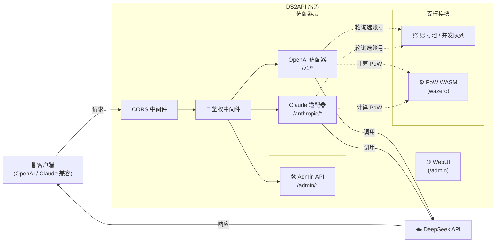

# DS2API

[](LICENSE)


[](version.txt)
[](DEPLOY.md)

语言 / Language: [中文](README.MD) | [English](README.en.md)

将 DeepSeek Web 对话能力转换为 OpenAI 与 Claude 兼容 API。后端为 **Go 全量实现**，前端为 React WebUI 管理台（源码在 `webui/`，部署时自动构建到 `static/admin`）。

## 架构概览



- **后端**：Go（`cmd/ds2api/`、`api/`、`internal/`），不依赖 Python 运行时
- **前端**：React 管理台（`webui/`），运行时托管静态构建产物
- **部署**：本地运行、Docker、Vercel Serverless、Linux systemd

## 核心能力

| 能力 | 说明 |
| --- | --- |
| OpenAI 兼容 | `GET /v1/models`、`GET /v1/models/{id}`、`POST /v1/chat/completions`、`POST /v1/responses`、`GET /v1/responses/{response_id}`、`POST /v1/embeddings` |
| Claude 兼容 | `GET /anthropic/v1/models`、`POST /anthropic/v1/messages`、`POST /anthropic/v1/messages/count_tokens` |
| 多账号轮询 | 自动 token 刷新、邮箱/手机号双登录方式 |
| 并发队列控制 | 每账号 in-flight 上限 + 等待队列，动态计算建议并发值 |
| DeepSeek PoW | WASM 计算（`wazero`），无需外部 Node.js 依赖 |
| Tool Calling | 防泄漏处理：非代码块高置信特征识别、`delta.tool_calls` 早发、结构化增量输出 |
| Admin API | 配置管理、账号测试 / 批量测试、导入导出、Vercel 同步 |
| WebUI 管理台 | `/admin` 单页应用（中英文双语、深色模式） |
| 运维探针 | `GET /healthz`（存活）、`GET /readyz`（就绪） |

## 平台兼容矩阵

| 级别 | 平台 | 当前状态 |
| --- | --- | --- |
| P0 | Codex CLI/SDK（`wire_api=chat` / `wire_api=responses`） | ✅ |
| P0 | OpenAI SDK（JS/Python，chat + responses） | ✅ |
| P0 | Vercel AI SDK（openai-compatible） | ✅ |
| P0 | Anthropic SDK（messages） | ✅ |
| P1 | LangChain / LlamaIndex / OpenWebUI（OpenAI 兼容接入） | ✅ |
| P2 | MCP 独立桥接层 | 规划中 |

## 模型支持

### OpenAI 接口

| 模型 | thinking | search |
| --- | --- | --- |
| `deepseek-chat` | ❌ | ❌ |
| `deepseek-reasoner` | ✅ | ❌ |
| `deepseek-chat-search` | ❌ | ✅ |
| `deepseek-reasoner-search` | ✅ | ✅ |

### Claude 接口

| 模型 | 默认映射 |
| --- | --- |
| `claude-sonnet-4-5` | `deepseek-chat` |
| `claude-haiku-4-5`（兼容 `claude-3-5-haiku-latest`） | `deepseek-chat` |
| `claude-opus-4-6` | `deepseek-reasoner` |

可通过配置中的 `claude_mapping` 或 `claude_model_mapping` 覆盖映射关系。
另外，`/anthropic/v1/models` 现已包含 Claude 1.x/2.x/3.x/4.x 历史模型 ID 与常见别名，便于旧客户端直接兼容。

## 快速开始

### 通用第一步（所有部署方式）

把 `config.json` 作为唯一配置源（推荐做法）：

```bash
cp config.example.json config.json
# 编辑 config.json
```

后续部署建议：
- 本地运行：直接读取 `config.json`
- Docker / Vercel：由 `config.json` 生成 `DS2API_CONFIG_JSON`（Base64）注入环境变量

### 方式一：本地运行

**前置要求**：Go 1.24+，Node.js 20+（仅在需要构建 WebUI 时）

```bash
# 1. 克隆仓库
git clone https://github.com/CJackHwang/ds2api.git
cd ds2api

# 2. 配置
cp config.example.json config.json
# 编辑 config.json，填入你的 DeepSeek 账号信息和 API key

# 3. 启动
go run ./cmd/ds2api
```

默认监听地址：`http://localhost:5001`

> **WebUI 自动构建**：本地首次启动时，若 `static/admin` 不存在，会自动尝试执行 `npm install && npm run build`（需要本机有 Node.js）。你也可以手动构建：`./scripts/build-webui.sh`

### 方式二：Docker 运行

```bash
# 1. 准备环境变量文件
cp .env.example .env

# 2. 从 config.json 生成 DS2API_CONFIG_JSON（单行 Base64）
DS2API_CONFIG_JSON="$(base64 < config.json | tr -d '\n')"

# 3. 编辑 .env，设置：
#    DS2API_ADMIN_KEY=请替换为强密码
#    DS2API_CONFIG_JSON=${DS2API_CONFIG_JSON}

# 4. 启动
docker-compose up -d

# 5. 查看日志
docker-compose logs -f
```

更新镜像：`docker-compose up -d --build`

### 方式三：Vercel 部署

1. Fork 仓库到自己的 GitHub
2. 在 Vercel 上导入项目
3. 配置环境变量（最少设置 `DS2API_ADMIN_KEY`；推荐同时设置 `DS2API_CONFIG_JSON`）
4. 部署

建议先在仓库目录复制模板并填写：

```bash
cp config.example.json config.json
# 编辑 config.json
```

推荐：先本地把 `config.json` 转成 Base64，再粘贴到 `DS2API_CONFIG_JSON`，避免 JSON 格式错误：

```bash
base64 < config.json | tr -d '\n'
```

> **流式说明**：`/v1/chat/completions` 在 Vercel 上默认走 `api/chat-stream.js`（Node Runtime）以保证实时 SSE。鉴权、账号选择、会话/PoW 准备仍由 Go 内部 prepare 接口完成；流式响应（含 `tools`）在 Node 侧执行与 Go 对齐的输出组装与防泄漏处理。

详细部署说明请参阅 [部署指南](DEPLOY.md)。

### 方式四：下载 Release 构建包

每次发布 Release 时，GitHub Actions 会自动构建多平台二进制包：

```bash
# 下载对应平台的压缩包后
tar -xzf ds2api_v1.7.0_linux_amd64.tar.gz
cd ds2api_v1.7.0_linux_amd64
cp config.example.json config.json
# 编辑 config.json
./ds2api
```

### 方式五：OpenCode CLI 接入

1. 复制示例配置：

```bash
cp opencode.json.example opencode.json
```

2. 编辑 `opencode.json`：
- 将 `baseURL` 改为你的 DS2API 地址（例如 `https://your-domain.com/v1`）
- 将 `apiKey` 改为你的 DS2API key（对应 `config.keys`）

3. 在项目目录启动 OpenCode CLI（按你的安装方式运行 `opencode`）。

> 建议优先使用 OpenAI 兼容路径（`/v1/*`），即示例里的 `@ai-sdk/openai-compatible` provider。
> 若客户端支持 `wire_api`，可分别测试 `responses` 与 `chat`，DS2API 两条链路都兼容。

## 配置说明

### `config.json` 示例

```json
{
  "keys": ["your-api-key-1", "your-api-key-2"],
  "accounts": [
    {
      "email": "user@example.com",
      "password": "your-password",
      "token": ""
    },
    {
      "mobile": "12345678901",
      "password": "your-password",
      "token": ""
    }
  ],
  "model_aliases": {
    "gpt-4o": "deepseek-chat",
    "gpt-5-codex": "deepseek-reasoner",
    "o3": "deepseek-reasoner"
  },
  "compat": {
    "wide_input_strict_output": true
  },
  "toolcall": {
    "mode": "feature_match",
    "early_emit_confidence": "high"
  },
  "responses": {
    "store_ttl_seconds": 900
  },
  "embeddings": {
    "provider": "deterministic"
  },
  "claude_model_mapping": {
    "fast": "deepseek-chat",
    "slow": "deepseek-reasoner"
  }
}
```

- `keys`：API 访问密钥列表，客户端通过 `Authorization: Bearer <key>` 鉴权
- `accounts`：DeepSeek 账号列表，支持 `email` 或 `mobile` 登录
- `token`：留空则首次请求时自动登录获取；也可预填已有 token
- `model_aliases`：常见模型名（如 GPT/Codex/Claude）到 DeepSeek 模型的映射
- `compat.wide_input_strict_output`：建议保持 `true`（当前实现默认宽进严出）
- `toolcall`：固定采用特征匹配 + 高置信早发策略
- `responses.store_ttl_seconds`：`/v1/responses/{id}` 的内存缓存 TTL
- `embeddings.provider`：embedding 提供方（当前内置 `deterministic/mock/builtin`）
- `claude_model_mapping`：字典中 `fast`/`slow` 后缀映射到对应 DeepSeek 模型

### 环境变量

| 变量 | 用途 | 默认值 |
| --- | --- | --- |
| `PORT` | 服务端口 | `5001` |
| `LOG_LEVEL` | 日志级别 | `INFO`（可选：`DEBUG`/`WARN`/`ERROR`） |
| `DS2API_ADMIN_KEY` | Admin 登录密钥 | `admin` |
| `DS2API_JWT_SECRET` | Admin JWT 签名密钥 | 等同 `DS2API_ADMIN_KEY` |
| `DS2API_JWT_EXPIRE_HOURS` | Admin JWT 过期小时数 | `24` |
| `DS2API_CONFIG_PATH` | 配置文件路径 | `config.json` |
| `DS2API_CONFIG_JSON` | 直接注入配置（JSON 或 Base64） | — |
| `DS2API_WASM_PATH` | PoW WASM 文件路径 | 自动查找 |
| `DS2API_STATIC_ADMIN_DIR` | 管理台静态文件目录 | `static/admin` |
| `DS2API_AUTO_BUILD_WEBUI` | 启动时自动构建 WebUI | 本地开启，Vercel 关闭 |
| `DS2API_ACCOUNT_MAX_INFLIGHT` | 每账号最大并发 in-flight 请求数 | `2` |
| `DS2API_ACCOUNT_CONCURRENCY` | 同上（兼容旧名） | — |
| `DS2API_ACCOUNT_MAX_QUEUE` | 等待队列上限 | `recommended_concurrency` |
| `DS2API_ACCOUNT_QUEUE_SIZE` | 同上（兼容旧名） | — |
| `DS2API_VERCEL_INTERNAL_SECRET` | Vercel 混合流式内部鉴权密钥 | 回退用 `DS2API_ADMIN_KEY` |
| `DS2API_VERCEL_STREAM_LEASE_TTL_SECONDS` | 流式 lease 过期秒数 | `900` |
| `VERCEL_TOKEN` | Vercel 同步 token | — |
| `VERCEL_PROJECT_ID` | Vercel 项目 ID | — |
| `VERCEL_TEAM_ID` | Vercel 团队 ID | — |
| `DS2API_VERCEL_PROTECTION_BYPASS` | Vercel 部署保护绕过密钥（内部 Node→Go 调用） | — |

## 鉴权模式

调用业务接口（`/v1/*`、`/anthropic/*`）时支持两种模式：

| 模式 | 说明 |
| --- | --- |
| **托管账号模式** | `Bearer` 或 `x-api-key` 传入 `config.keys` 中的 key，由服务自动轮询选择账号 |
| **直通 token 模式** | 传入 token 不在 `config.keys` 中时，直接作为 DeepSeek token 使用 |

可选请求头 `X-Ds2-Target-Account`：指定使用某个托管账号（值为 email 或 mobile）。

## 并发模型

```
每账号可用并发 = DS2API_ACCOUNT_MAX_INFLIGHT（默认 2）
建议并发值 = 账号数量 × 每账号并发上限
等待队列上限 = DS2API_ACCOUNT_MAX_QUEUE（默认 = 建议并发值）
429 阈值 = in-flight + 等待队列 ≈ 账号数量 × 4
```

- 当 in-flight 槽位满时，请求进入等待队列，**不会立即 429**
- 超出总承载上限后才返回 `429 Too Many Requests`
- `GET /admin/queue/status` 返回实时并发状态

## Tool Call 适配

当请求中带 `tools` 时，DS2API 会做防泄漏处理：

1. 只在**非代码块上下文**启用 toolcall 特征识别（代码块示例不会触发）
2. 一旦命中高置信特征（`tool_calls` + `name` + `arguments/input` 起始）就立即输出 `delta.tool_calls`
3. 已确认的 toolcall JSON 片段不会泄漏到 `delta.content`
4. 前文/后文自然语言保持顺序透传，支持混合文本与增量参数输出

## 项目结构

```text
ds2api/
├── cmd/
│   ├── ds2api/              # 本地 / 容器启动入口
│   └── ds2api-tests/        # 端到端测试集入口
├── api/
│   ├── index.go             # Vercel Serverless Go 入口
│   ├── chat-stream.js       # Vercel Node.js 流式转发
│   └── helpers/             # Node.js 辅助模块
├── internal/
│   ├── account/             # 账号池与并发队列
│   ├── adapter/
│   │   ├── openai/          # OpenAI 兼容适配器（含 Tool Call 解析、Vercel 流式 prepare/release）
│   │   └── claude/          # Claude 兼容适配器
│   ├── admin/               # Admin API handlers
│   ├── auth/                # 鉴权与 JWT
│   ├── config/              # 配置加载与热更新
│   ├── deepseek/            # DeepSeek API 客户端、PoW WASM
│   ├── server/              # HTTP 路由与中间件（chi router）
│   ├── sse/                 # SSE 解析工具
│   ├── util/                # 通用工具函数
│   └── webui/               # WebUI 静态文件托管与自动构建
├── webui/                   # React WebUI 源码（Vite + Tailwind）
│   └── src/
│       ├── components/      # AccountManager / ApiTester / BatchImport / VercelSync / Login / LandingPage
│       └── locales/         # 中英文语言包（zh.json / en.json）
├── scripts/
│   ├── build-webui.sh       # WebUI 手动构建脚本
│   └── testsuite/           # 测试集运行脚本
├── static/admin/            # WebUI 构建产物（不提交到 Git）
├── .github/
│   ├── workflows/           # GitHub Actions（Release 自动构建）
│   ├── ISSUE_TEMPLATE/      # Issue 模板
│   └── PULL_REQUEST_TEMPLATE.md
├── config.example.json      # 配置文件示例
├── .env.example             # 环境变量示例
├── Dockerfile               # 多阶段构建（WebUI + Go）
├── docker-compose.yml       # 生产环境 Docker Compose
├── docker-compose.dev.yml   # 开发环境 Docker Compose
├── vercel.json              # Vercel 路由与构建配置
├── go.mod / go.sum          # Go 模块依赖
└── version.txt              # 版本号
```

## 文档索引

| 文档 | 说明 |
| --- | --- |
| [API.md](API.md) / [API.en.md](API.en.md) | API 接口文档（含请求/响应示例） |
| [DEPLOY.md](DEPLOY.md) / [DEPLOY.en.md](DEPLOY.en.md) | 部署指南（本地/Docker/Vercel/systemd） |
| [CONTRIBUTING.md](CONTRIBUTING.md) / [CONTRIBUTING.en.md](CONTRIBUTING.en.md) | 贡献指南 |
| [TESTING.md](TESTING.md) | 测试集使用指南 |

## 测试

```bash
# 单元测试
go test ./...

# 一键端到端全链路测试（真实账号，生成完整请求/响应日志）
./scripts/testsuite/run-live.sh

# 或自定义参数
go run ./cmd/ds2api-tests \
  --config config.json \
  --admin-key admin \
  --out artifacts/testsuite \
  --timeout 120 \
  --retries 2
```

## Release 自动构建（GitHub Actions）

工作流文件：`.github/workflows/release-artifacts.yml`

- **触发条件**：仅在 GitHub Release `published` 时触发（普通 push 不会触发）
- **构建产物**：多平台二进制包（`linux/amd64`、`linux/arm64`、`darwin/amd64`、`darwin/arm64`、`windows/amd64`）+ `sha256sums.txt`
- **每个压缩包包含**：`ds2api` 可执行文件、`static/admin`、WASM 文件、配置示例、README、LICENSE

## 免责声明

本项目基于逆向方式实现，仅供学习与研究使用。稳定性和可用性不作保证，请勿用于违反服务条款或法律法规的场景。
